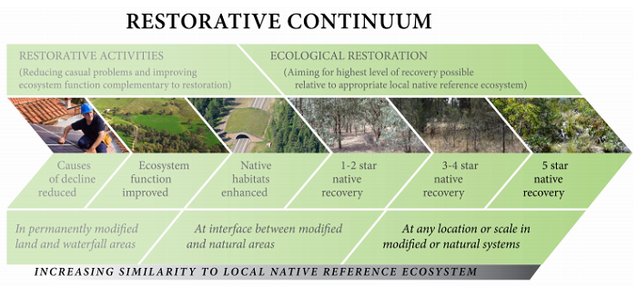
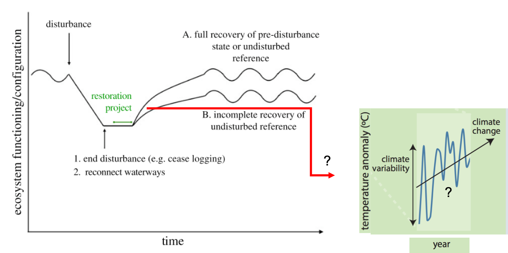
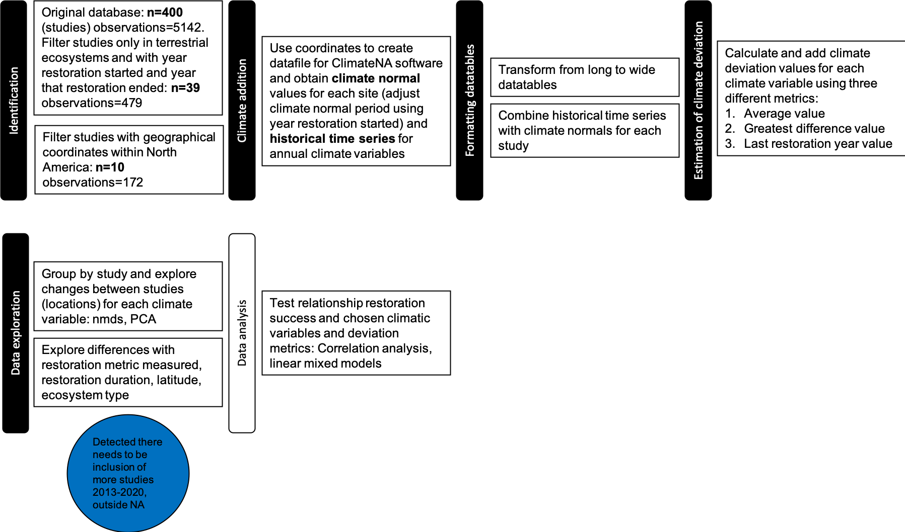
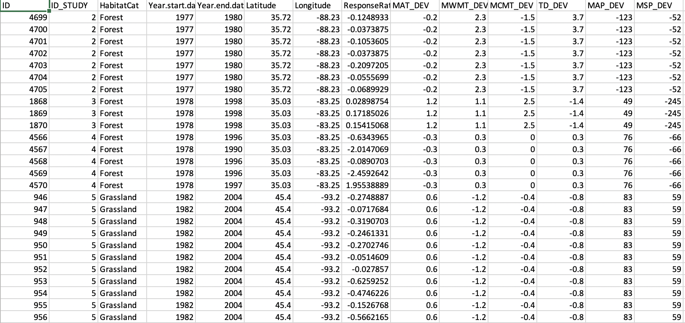
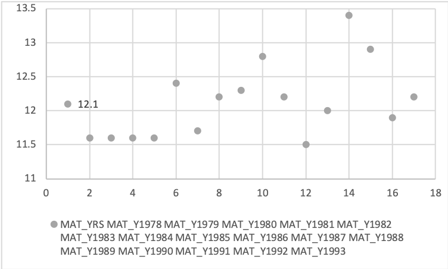

# Does climate deviation can predict if restoration of terrestrial ecosystems will be successful? 

In this study I want to analyze if there is a relationship between **climate deviation** and the success of **restoration** in terrestrial ecosystems.  If climatic conditions have deviated from the climate normal values during which the restoration goals were established, the conditions for successful restoration might not exist in the same way as before. Setting restoration efforts to miss their goals from the start. Consideration of recent changes in climatic conditions when developing management plans and establishing restoration targets could help identify restoration priorities. Sites where the climatic conditions have deviated from normal values could either adjust their targets or active restoration efforts could be better directed to less altered ecosystems. 

   

## 1. Intro

Ecological restoration intends to re-establish, improve or create ecosystem functions or characteristics previous to a disturbance. The recovery of an ecosystem following restoration then is measured against extant reference ecosystems or pre-disturbance conditions in the same ecosystem (reference). Climate is intrinsically implicated in restoration because it influences current ecosystem processes and characteristics, affecting the ecological path an ecosystem follows following restoration activities; and because climate varies in time it can affect restoration goals and/or metrics that are based in past climate conditions. Moreover, current climatic conditions in certain regions are rapidly changing, and extreme climatic events have been more frequent across the globe (reference). Hence, if restoration and ecosystem management plans do not consider changes in climate, they may fall out of context and become impractical when faced with current and future changes brought by climate extremes and other associated disturbances (Hiers et al., 2016; Robinson et al., 2021). 

A meta-analysis study on the recovery of restored ecosystems following disturbances found that although ecosystems progress towards restoration, usually a complete recovery is never reached (Jones et al., 2018). But importantly, the authors also found that the degree and rate of recovery was variable depending on factors like ecosystem type and the recovery metrics used to measure restoration success. Monitoring the outcomes of restoration actions against the restoration targets is necessary and although restoration projects have been increasingly performing an evaluation (reference), this is usually done on an individual-project basis, hence knowledge on patterns of recovery across different ecosystems globally is still reduced (Jones et al., 2018). 

To address this, there have been proposals to for assessing the previous climatic conditions in the site that is to be restored. These have involved the use of climate normals as reasonable time period to compare and… (Soulé, 2005; Millar and Woolfenden, 1999; Copeland et al 2018). If climatic variables in a disturbed ecosystem have deviated considerably compared to its ‘climate normal’ values (Marchi et al., 2020), the conditions for restoration might not exist in the same way as before. Thus, by assessing the recovery of past restoration sites based on the meta-analysis by Jones and collaborators (2018) and incorporating the climate values to assess climate deviation from normals,  I intend to test if it could be a tool for future management plans and establishing restoration goals. 

   

 

### Research objectives

- Establish restoration success (response ratio of recovery completeness) for studies from 2013-2020 in North America - (*identified from data exploration*)

- Determine if there are climatic variables that affect the recovery trajectory of a restored ecosystem more than others

- Identify if there is relationship between climate deviation and restoration success and which factors participate in the direction and strenght of the relationship (e.g. ecosystem type, latitude, restoration period, recovery metric) 

### Expected results

Increasing climate deviation from climate normal values in a site will have a negative relationship with restoration succes. This will be dependent on the type of ecosystem and latitude where restoration occurred, the type of metric used to evaluate restoration success, and the climatic variable considered. If the relationship is testable, then this could serve in restoration ecology for creating restoration models and could eventually be used in restoration practices. The identification of sites where relevant climatic variables (according to the ecosystem and latitude) have deviated considerably,  would help establish restoration priorities to save time and money. Active restoration could be targeted towards places more prone to recover. 

## 2. Methods 

Obtaining climate values : Since the period when each restoration varied in duration and start year,  climate normals and historical time series for annual climate variables were designated on a study by study basis. That is, according to the year when the restoration started, the closest climate normal period was chosen for each study. For the historical time series, a period encompassing the first year to the last year of restarion was selected for each study. 

Climate deviation estimation: I am still exploring which metric to use to estimate climate deviation. I have understood climate deviation as climate anomalies (Soule 2005) but I also must account for the extreme climatic changes and the variation in duration of restoration periods across studies. 
For this reason for this project I am exploring three different datasets where each dataset comes from a different climate deviation estimation:

1. **AVERAGE**: Obtain the average value across restoration period and subtract from this the corresponding climate normal value for each climate variable
2. **GREATEST DIFFERENCE**: Choose the value that deviated the most from the climate normal value across the restoration period and subtract from this the corresponding climate normal value for each climate variable
3. **LAST RESTORATION YEAR**: Choose the values for the last year during which restoration took place and subtract from this the corresponding climate normal value for each climate variable 

   

When doing data exploration I have noted I need to incorporate more studies within North America because after filtering for the parameters my study requires, the n reduced to 10. Since the observations are nested within the study because they all come from the same location, I need as much datapoints as possible to be able to compare across latitudes and ecosystem types. Following steps:

1. Incorporate studies from 2013-2020 to original database
2. Calculate response ratios of recovery completeness for new studies
3. Data exploration with increased database
4. Statistical analysis: establishing associations between climate deviation dataset and recovery completeness dataset 

## 3. Data 

The central goal of this study is to measure the relationship between deviation of climatic variables (*predictor variable*) and recovery completeness (*response variable*). 

**Experimental units**: each ecosystem property that was evaluated following restoration is an experimental unit because it has a different recovery value, but this is nested within the study where it comes from, i.e. observations are not independent. 

During this stage I am estimating the predictor variable values for each restoration site, that is establishing the climate variables that will be useful and the deviation for each of them. 

This is how my first [datatable](data/DEV3.csv) (predictor variables) looks like: 

   

The original data looks like this

Data table for each location including climate 

How data should look like

Show data exploration graphics, for each climate variable, for each site, explore each metric, normality 

This how temperature behaves in a site compared to its normal 

   
  

## 4. Results and Discussion

Plans to receive feedback 

### 5. Conclusions, About, References

Inser reference to the other meta-analysis, references, 

