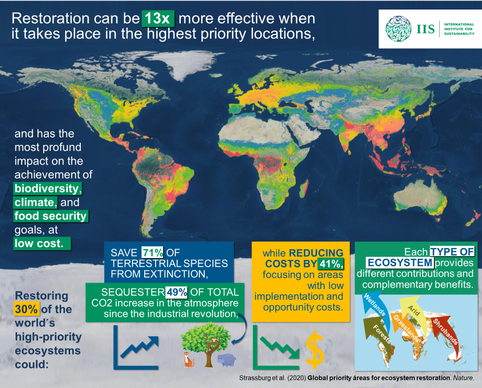
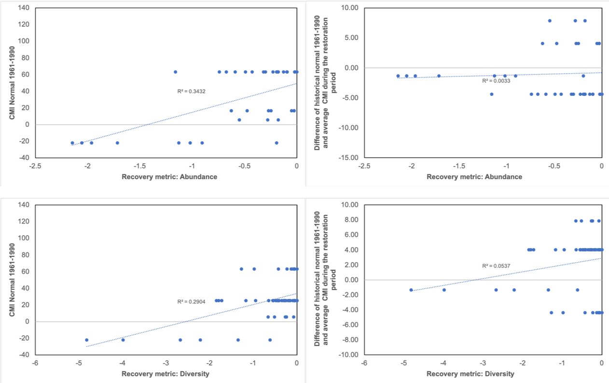
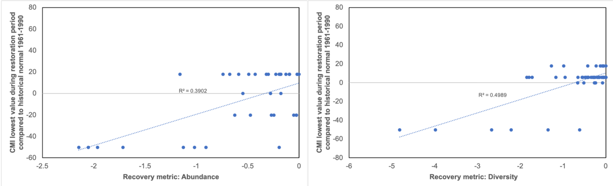
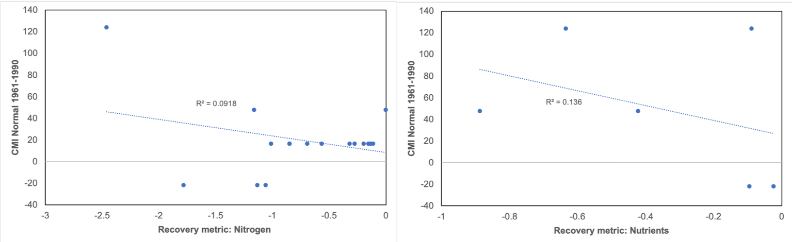
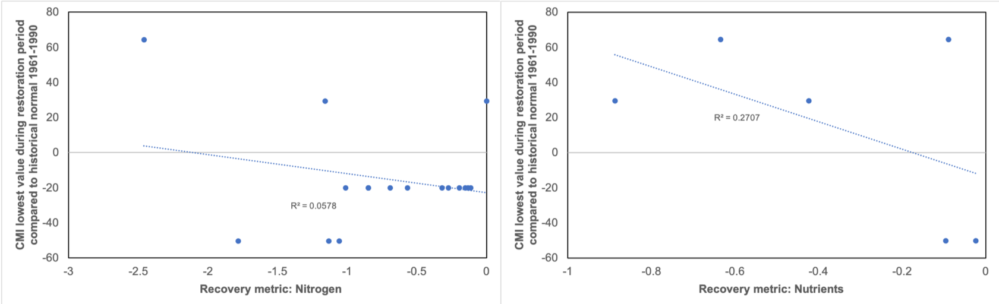
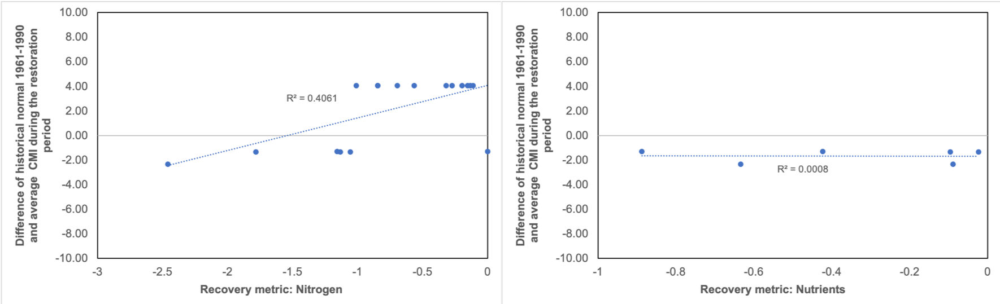

# Can climate anomalies and trends predict the restoration trajectory of terrestrial ecosystems? 

In this study I am analyzing if there is an association between **climate trends** and **anomalies** and the success of **restoration** in terrestrial ecosystems.  If climatic conditions have deviated from the historical normal values considered when the restoration goals were established, the conditions for what was considered successful restoration might not exist anymore. To test if this is the case I am performing a meta-analysis with terrestrial restoration studies in North America. Using recovery completeness as a proxy for restoration success and climate moisture index, I checked the associations of general dryness, climate trends and extreme events with restoration success separately for each recovery metric. I found there is a trend towards possitive associations between decreasing dryness and biodiversity metrics of recovery. However the associations become less clear when evaluating soil aspects including nitrogen and other soil nutrients, likely there are more factors like latitude and broader nutrient cycling patterns that help explain this variation but this needs further exploration. Lastly I found that extreme drought events are more strongly associated with less recovery of biodiversity in forests and grasslands. Thus, this early evidence suggests consideration of baseline climate and extreme drought events could help establish restoration priorities for biodiversity and set achievable and cost-effective goals. 

## 

In this repository you can find: 
- The original [database](/data/Clim_dev_test.csv) with all the studies' information and the second [database](/data/Data_2_for_github.csv) that includes climate values in the [data](/data/) folder
- The output files including graphs, tables and images for illustration of this project in the [output](/output/) folder
- R script for multivariate analysis (*in progress*)

##

## 1. Intro

Ecological restoration intends to re-establish, improve or create ecosystem functions or characteristics previous to a disturbance. The recovery of an ecosystem following restoration then is measured against extant reference ecosystems or pre-disturbance conditions in the same ecosystem [1]. Climate is intrinsically implicated in restoration because it influences current ecosystem processes and attributes, affecting the ecological path an ecosystem follows following restoration activities[2]; and because climate varies in time it can affect restoration goals and/or metrics that are based in past climate conditions. Moreover, current climatic conditions in certain regions are rapidly changing, and extreme climatic events have been more frequent across the globe [3,4]. Hence, if restoration and ecosystem management plans do not consider changes in climate, they may fall out of context and become impractical when faced with current and future changes brought by climate extremes and other associated disturbances [2,5].  

A meta-analysis study on the success of restored ecosystems following disturbances found that although ecosystems progress towards restoration, usually a complete recovery is never reached [6]. But importantly, the authors also found that the degree and rate of recovery was variable depending on factors like ecosystem type and the recovery metrics used to measure restoration success (Figure 1). Monitoring the outcomes of restoration actions against the restoration targets is necessary and although restoration projects have been increasingly performing an evaluation [7], this is usually done on an individual-project basis, hence knowledge on patterns of recovery across different ecosystems globally is still reduced [6,8]. 

   
  

 
 Figure 1. Restoration priorities map from the [International Institute for Sustainable Development](https://www.iis-au.org/publications/global-priority-areas-for-ecosystem-restoration/) 
 
 
  
  To address this, there have been proposals to assess the previous climatic conditions in the site that is to be restored. Some of these have involved the use of historical normal climate values as reasonable time period to compare to a pre-climate change condition [2,4,9,10]. If climatic variables in a disturbed ecosystem have deviated considerably compared to its historical normal values, the conditions for restoration might not exist in the same way as before (Figure 2). Thus, by assessing the extent of recovery of past restoration sites based on the metric used by Jones and collaborators [6], and incorporating climate normal, trends and anomalies, I intend to test if this could be a tool used in management plans and help setting restoration goals. I am focusing in climate moisture index (CMI) as this is one the climate components that most affects the dynamics of terrestrial ecosystem in North America [11,12]. If I find associations of restoration failure with observed CMI trends and anomalies, then this would be evidence that restoration ecology should shift away from restore what was there before, and instead set goals that consider new and anticipated climates while also priotitizing where is most needeed and most likely to be successful. 

   

 
 Figure 2. Trajectory of an ecosystem following restoration affected by climate variation. Modified from reference [6]

### Research objectives

- To account for the importance of baseline conditions I want to identify if there is an association between general dryness and restoration success and if recovery metric participates in the direction and strenght of the association

- Incorporate CMI trends and severe drought events and analyze its association with restoration success

### Expected results

Greatest  differences from CMI historical normal values and the severity of drought events will have an association with restoration failure. This association may be dependent on the type of metric used to evaluate restoration success. If there is an association the more climate has changed the less successful the restoration efforts will be, so  this could be used to set goals where climate trends and extreme events are incorporated to create more attainable results that are sustainable and useful. If there is no association then other climate variables or conditions like latitude, nutrient cycling and ecosystem type should be analyzed as well. 

## 2. Methods 

1. Restoration success 

To determine restoration success I used an effect size that is commonly used in meta-analysis known as **response ratio** [6,13]. This response ratio is what Jones and collaborators used in their study [6] to determine recovery completeness. For this project I re-calculated the response ratios to check accuracy of results. Response ratio was calculated like this: 

  Response ratio = Ln (End/Goal) 

 End: represents the recovery variable's value at the end of the study and 

 Goal: represents the reference goal value to be reached. 

2. Climate variables 

I used three different variables for CMI to test the role of climate, climate trends and anomalies: 

a) **CMI NORMAL 1961-1990**: Obtained the average CMI values for the climate period of 1961-1990 for each location. This can be considered as historical conditions pre-climate change.

b) **CMI restoration period**: Obtained the average CMI values for the duration of the restoration period for each observation and used the difference of these compared to the CMI normal 1961-1990 values. This would correspond to longer term climate trends. 

c) **CMI extreme**: Choosed the highest negative (or smaller number if no negatives) CMI anomaly during the restoration period for each location. This represents the most severe drought event during the restoration.

3. Recovery variables

I focused in the most commonly assessed recovery variables in the database: diversity, abundance, community characteristics (referring to composition), soil characteristics, organic matter, nitrogen, phosphorus, carbon, and nutrients. These were identified from the original study [6]. However for this project I only used 'diversity' (species diversity), 'abundance' (biomass), soil 'nitrogen' and other soil 'nutrients' because there was not enough data points for the other recovery metrics. 
  
  The order of these steps can be followed in the project pipeline (Figure 3).  

   

 
 Figure 3. Project pipeline 

##

The 10 different sites where data were collected are mostly located in the Eastern United States (Figure 4).  

   

 
 Figure 4. Location of restoration sites

## 3. Data 

The dataset is divided into 2 database tables:

1. The original [database](data/Clim_dev_test.csv) containing all restoration metrics and study information

2. The database containing the study's basic identification information, recovery metric value,  and values for the three CMI types of variables 

- Experimental units: each aspect that was evaluated for recovery across the sites is considered a an experimental unit, but this is nested within the study where it comes from, i.e. observations are not independent. 

This is how the second [database table](data/Data_2_for_github.csv) looks like: 

 Table1. Database table of studies and climate variables 

   

  
  Where each row refers to a different observation. Starting at the left side columns contain the study's information for each observation and next are the recovery variables and the last columns are the climate variables (the complete database contains more climate observations that the ones shown here, a  breakdown of the information can be found in Table 2). The climate variables (predictor variables) are continuous and the recovery values (response variables) are also continuous. 

 Table 2. Variables used in dataset of Table 1 

   

## 4. Results and Discussion

I analyzed the recovery of diversity, abundance (biomass), soil nitrogen and other soil nutrients and I found two different patterns in relation to CMI that can be divided into diversity/abundance metrics and soil characteristics metrics. 

### Drought decreases recovery in biodiversity 

For recovery of these two metrics, there was an association between general dryness and a lack of recovery. These are data mostly drawn from forests so it makes sense that greater CMI is strongly associated with greater recovery of biomass and species diversity (Figure 5). There was no clear association between CMI trends and the recovery of abundance and diversity. 

   

 

 Figure 5. Scatterplot for recovery of diversity (upper left side) and abundance (upper right side) over CMI normal values (1961-1990) and CMI trends 

 The lack of association between CMI trends and restoration success can have two different explanations. First it can be that CMI trends do not explain the variation in recovery of diversity and abundance and so it is general dryness as a baseline condition and extreme events that participate in shaping the recovery trajectories. If that is the case still more data are needed to confirm this explanation. The second option is that during the years of the restoration CMI does not reflect significant change because for most of these studies the restoration occurred in the late 80s and early 90s and perhaps climate trends were not that different to the historical normal period just yet. If this is the case then by including more data coming from studies where restoration occurred more recently, that is likely greater changes in climate trends, I should find a greater response from recovery to CMI trends. 

 When observing CMI anomalies the association was stronger, drought events were strongly associated with less recovery (Figure 6). 

   

 Figure 6. Scatterplot of recovery of diversity (A) and abundance (B) as a function of the largest CMI anomaly during the restoration relative to the historical normal 

 
 Climate extreme events are becoming more frequent and in particular severe droughts are already affecting forests' biodiversity and productivity [12]. Hence it is not surprising that these events affect the success of restoration. However, these events are also getting more accurately predicted, and so knowing that there is a a strong association with restoration success, if a site has gone or will go through important drought events the restoration approach can contemplate for different conditions by adjusting the goals and choosing methods and species that are known to adapt to these conditions. 
   
### No clear patterns for drought and soil nutrients

For the recovery metrics referring to soil attributes (in this case nitrogen and other soil nutrients) some of the results were less clear as the data were more dispersed. I found weak associations of general dryness and increasing recovery of soil nitrogen and other nutrients (Figure 7). For the anomalies it was similar, it appears that wetter conditions associated with less recovery, weakly for  nitrogen but more clearly for other nutrients (Figure 8). Also contrastingly to all other recovery metrics, there was a strong association between climate trends for drought and lack of soil nitrogen recovery (Figure 9).  

   

 Figure 7. Scatterplot of recovery of soil nitrogen (left panel) and nutrients (right panel) over CMI normal values (1961-1990)
 
 

   

 Figure 8. Scatterplot of recovery of soil nitrogen (left panel) and nutrients (right panel) as a function of the largest CMI anomaly during the restoration relative to the historical normal 

 
 

   

 Figure 9. Scatterplot of recovery of soil nitrogen (left panel) and nutrients (right panel) over CMI trends 

The variation found can be explained with the influence of several factors mainly being the dynamics of nitrogen and soil nutrients, the role of climate variables other than CMI, and most importantly at this stage the reduced number of observations. Firstly, there is less understanding in what the soil characteristics measured in the studies represent for the recovery of each site, I need to study in more detail the original classification in the meta-analysis as for example more nitrogen deposition is not necessarily a sign of recovery. Although nutrient cycling generally recovers rapidly following disturbance in forest ecosystems [14] the dynamics are more complex to study than for biodiversity. Other climate variables may be participating, in the eastern United States wetter conditions have been observed [15] which could alter the dynamics of nutrient cycling, moving away from reference goals in a different direction than biodiversity with increasing drought. Lastly, the lesser number of observations is likely influencing these results and there might be a different response once more studies are included, particularly for soil nitrogen there appears to be one site driving a change in trajectory (Figures 7 and 8). It would be interesting once more data on the western side is included to see if these patterns change. 

## 5. Conclusions

It appears that baseline normal conditions and severe drought events contribute to the failure of restoration when considering biodiversity assessments, however for soil nutrients the contribution of climate seems less clear or not as important. In both cases further analysis and data compilation is needed to formulate robust conclusion. Lastly, because of the complexity of the recovery data in this meta-analysis from this initial approach I conclude that once I gather more recent studies that possibly allow me to analyze climate conditions more broadly, a detailed evaluation of recovery metric classification would be needed to be able to characterize recovery patterns, and also see if there are factors like latitude and ecosystem type affecting the strenght and direction of the associations.

### Following directions

- Increase the number of studies and expand to global assessments to be able to evaluate the role of geographical location. 

- Determine if there are other climatic variables that may be useful and have an association to the recovery trajectory of a restored ecosystem

- Multivariate analysis once more data are included to be able to draw accurate conclusions of the role and contribution of each CMI variable and other climate variables to the variation found in restoration success

### References ###
[1] Hobbs, R. J., & Norton, D. A. (1996). Towards a conceptual framework for restoration ecology. Restoration ecology, 4(2), 93-110 

[2] Millar, C. I., & Woolfenden, W. B. (1999). The role of climate change in interpreting historical variability. Ecological Applications, 9(4), 1207-1216.

[3] IPCC: Climate Change 2014: Synthesis Report, in: Contribution of Working Groups I, II and III to the Fifth Assessment Report of the Intergovernmental Panel on Climate Change, edited by: Core Writing Team, Pachauri, R. K., and Meyer, L. A., IPCC, Geneva, Switzerland, 151 pp., 2014.

[4] Robinson, A., Lehmann, J., Barriopedro, D., Rahmstorf, S., & Coumou, D. (2021). Increasing heat and rainfall extremes now far outside the historical climate. npj Climate and Atmospheric Science, 4(1), 1-4.

[5] Harris, J. A., Hobbs, R. J., Higgs, E., & Aronson, J. (2006). Ecological restoration and global climate change. Restoration Ecology, 14(2), 170-176.

**[6] Jones, H. P., Jones, P. C., Barbier, E. B., Blackburn, R. C., Rey Benayas, J. M., Holl, K. D., ... & Mateos, D. M. (2018). Restoration and repair of Earth's damaged ecosystems. Proceedings of the Royal Society B: Biological Sciences, 285(1873), 20172577.**

[7] Lake, P. S. (2001). On the maturing of restoration: linking ecological research and restoration. Ecological Management & Restoration, 2(2), 110-115.

[8] Meli, P., Holl, K. D., Rey Benayas, J. M., Jones, H. P., Jones, P. C., Montoya, D., & Moreno Mateos, D. (2017). A global review of past land use, climate, and active vs. passive restoration effects on forest recovery. Plos one, 12(2), e0171368.

[9] Soule, P. T. (2005). A comparison of 30-yr climatic temperature normals for the southeastern United States. southeastern geographer, 45(1), 16-24.

[10] Copeland, S. M., Munson, S. M., Bradford, J. B., & Butterfield, B. J. (2019). Influence of climate, post‐treatment weather extremes, and soil factors on vegetation recovery after restoration treatments in the southwestern US. Applied Vegetation Science, 22(1), 85-95.

[11] Hogg, E.H., Barr, A.G., and Black, T.A. (2013). A simple soil moisture index for representing multi-year drought impacts on aspen productivity in the western Canadian interior. Agricultural and Forest Meteorology 178-179, 173-182. 

[12] Natural Resources Canada. Climate change impacts on forests: drought. In https://www.nrcan.gc.ca/climate-change/impacts-adaptations/climate-change-impacts-forests/forest-change-indicators/drought/17772 consulted on April 08, 2022. 

[13] Rey-Benayas JM, Newton AC, Diaz A, Bullock JM. (2009). Enhancement of biodiversity and ecosystem services by ecological restoration: a meta-analysis. Science 325, 1121–1124. 

[14] Martineau, C., Beguin, J., Séguin, A., and Paré, D.(2020). Cumulative effects of disturbances on soil nutrients: predominance of antagonistic short-term responses to the salvage logging of insect-killed stands. Ecosystems 23, 812-827. 

[15] United States Environmental Protection Agency. Climate change indicators. In https://www.epa.gov/climate-indicators/climate-change-indicators-drought consulted on April 13, 2022. 

