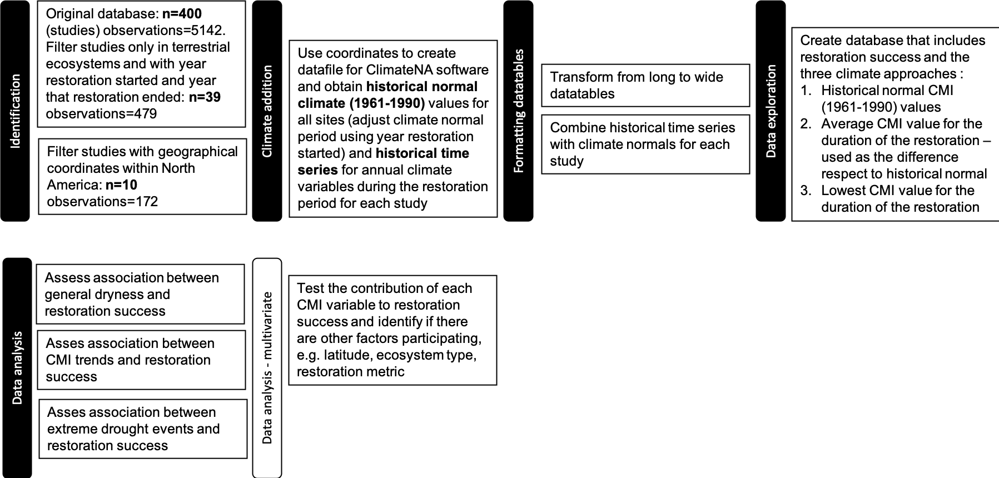
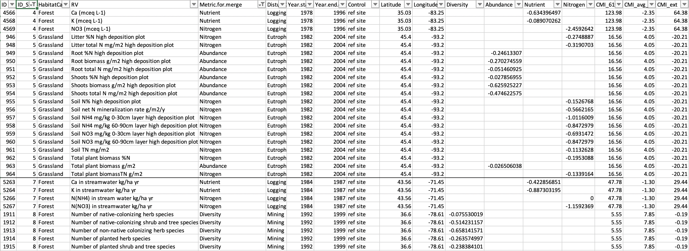
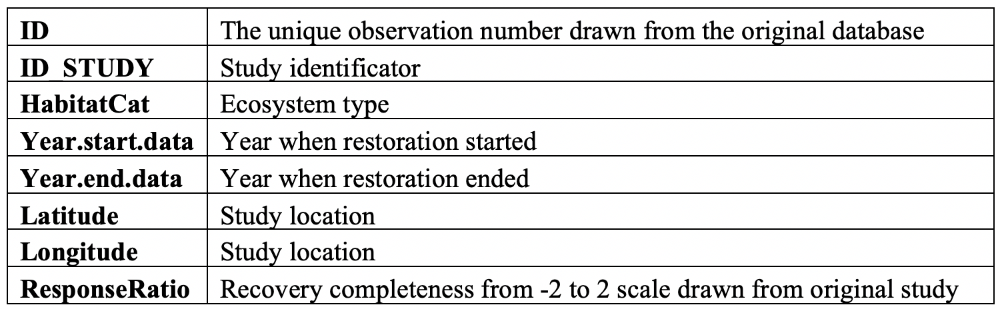
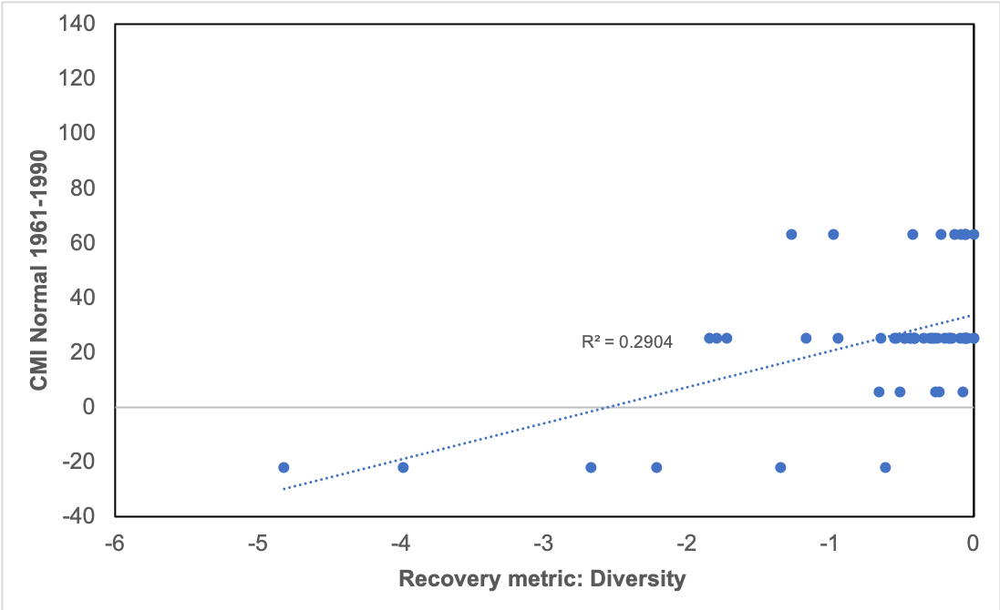
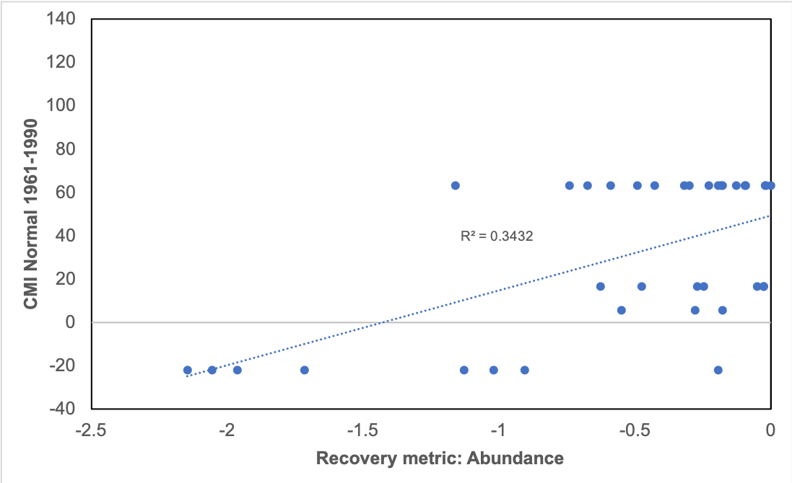
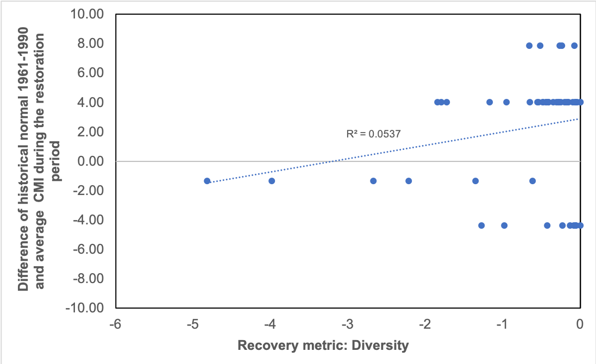
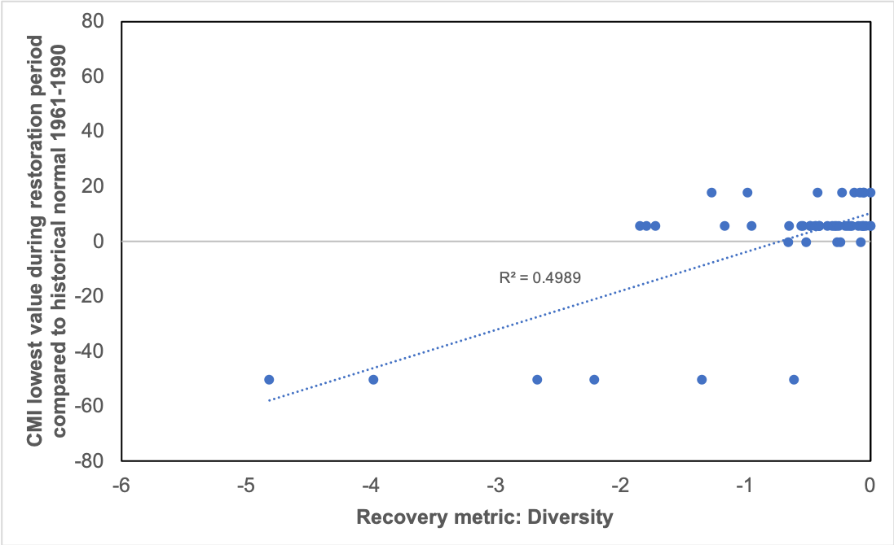

# Can climate anomalies and trends predict the restoration trajectory of terrestrial ecosystems? 

In this study I am analyzing if there is an association between **climate trends** and **anomalies** and the success of **restoration** in terrestrial ecosystems.  If climatic conditions have deviated from the historical normal values considered when the restoration goals were established, the conditions for what was considered successful restoration might not exist anymore. To test if this is the case I am performing a meta-analysis with terrestrial restoration studies in North America. Using recovery completeness as a proxy for restoration success and climate moisture index, I checked the associations of general dryness, climate trends and extreme events with restoration success separately for each recovery metric. I found there is a trend towards possitive associations between decreasing dryness and biodiversity metrics of recovery. However the associations become less clear when evaluating soil aspects including nitrogen and soil nutrients, likely there are other factors like latitude and broader nutrient cycling processes that help explain this variation but this needs further exploration. Lastly I found that extreme drought events are more strongly associated with less recovery in forests and grasslands. Thus, this early evidence suggests consideration of general climate and extreme drought events could help establish restoration priorities and set achievable and cost-effective goals that increase the succes of restoration projects. 

## 

In this repository you can find: 
- R script for data exploration in the [bin](bin/) folder
- The original [database](/data/Clim_dev_test.csv) with all the studies' information and the second [database](/data/Data_2_for_github.csv) that includes climate values in the [data](/data/) folder
- The output files including graphs, tables and images for illustration of this project in the [output](/output/) folder

##

## 1. Intro

Ecological restoration intends to re-establish, improve or create ecosystem functions or characteristics previous to a disturbance. The recovery of an ecosystem following restoration then is measured against extant reference ecosystems or pre-disturbance conditions in the same ecosystem [1]. Climate is intrinsically implicated in restoration because it influences current ecosystem processes and attributes, affecting the ecological path an ecosystem follows following restoration activities[2]; and because climate varies in time it can affect restoration goals and/or metrics that are based in past climate conditions. Moreover, current climatic conditions in certain regions are rapidly changing, and extreme climatic events have been more frequent across the globe [3,4]. Hence, if restoration and ecosystem management plans do not consider changes in climate, they may fall out of context and become impractical when faced with current and future changes brought by climate extremes and other associated disturbances [2,5].  

A meta-analysis study on the success of restored ecosystems following disturbances found that although ecosystems progress towards restoration, usually a complete recovery is never reached [6]. But importantly, the authors also found that the degree and rate of recovery was variable depending on factors like ecosystem type and the recovery metrics used to measure restoration success. Monitoring the outcomes of restoration actions against the restoration targets is necessary and although restoration projects have been increasingly performing an evaluation [7], this is usually done on an individual-project basis, hence knowledge on patterns of recovery across different ecosystems globally is still reduced [6,8]. 

Modify:

   

 Figure 1. Restorative continuum. "Activities undertaken by society to repair damage to the broader environment, complement ecological restoration and provide improved conditions for broad scale recovery". From the [Society for Ecological Restoration](https://www.ser.org/general/custom.asp?page=SERNews3112)

To address this, there have been proposals to assess the previous climatic conditions in the site that is to be restored. Some of these have involved the use of historical normal climate values as reasonable time period to compare to a pre-climate change condition [2,4,9,10]. If climatic variables in a disturbed ecosystem have deviated considerably compared to its historical normal values, the conditions for restoration might not exist in the same way as before. Thus, by assessing the extent of recovery of past restoration sites based on the metric used by Jones and collaborators [6], and incorporating climate normal, trends and anomalies, I intend to test if this could be a tool used in management plans and help setting restoration goals. I am focusing in climate moisture index (CMI) as this is one the climate components that most affects the dynamics of terrestrial ecosystem in North America [11,12]. If I find associations of restoration failure with observed CMI trends and anomalies, then this would be evidence that restoration ecology should shift away from restore what was there before, and instead set goals that consider new and anticipated climates while also priotitizing to where is most needeed and most likely to be successful . 

   

 Figure 2. Trajectory of an ecosystem following restoration affected by climate variation. Modified from reference [6]

### Research objectives

- Identify if there is an association between general dryness and restoration success and the factors that participate in the direction and strenght of the association (e.g. ecosystem type, latitude, restoration period, recovery metric). 

- Analyze and consider CMI trends and extreme events in association to restoration success or failure. 

- Establish restoration success (response ratio of recovery completeness) for studies from 2013-2020 in North America - (*in process*)

### Expected results

Greatest negative differences from CMI historical normal values in a site will have an association with restoration failure. This association will be dependent on the type of ecosystem and latitude where restoration occurred, and the type of metric used to evaluate restoration success. 

## 2. Methods 

1. Restoration success 

To determine restoration success I used an effect size that is commonly used in meta-analysis known as **response ratio** [6,13]. This response ratio is what Jones and collaborators used in their study [6] to determine recovery completeness. For this project I re-calculated the response ratios to check accuracy of results. Response ratio was calculated like this: 

**Response ratio = Ln (End/Goal)** 

*End* represents the recovery variable's value at the end of the study and,

*Goal* represents the reference goal value to be reached. 

2. Climate variables 

I used three different variables for CMI to test the role of climate, climate trends and anomalies: 

a) **CMI NORMAL 1961-1990**: Obtained the average CMI values for the climate period of 1961-1990 for each location. This can be considered as historical conditions pre-climate change.

b) **CMI restoration period**: Obtained the average CMI values for the duration of the restoration period for each observation and used the difference of these compared to the CMI normal 1961-1990 values. This would correspond to longer term climate trends. 

c) **CMI extreme**: Choose the largest negative CMI anomaly during the restoration period. This represents the most severe drought event during the restoration.

3. Recovery variables

I focused on those variables most commonly assessed in the database for terrestrial ecosystems: diversity, abundance, community characteristics (referring to composition), soil characteristics, organic matter, nitrogen and nutrients. These were identified from the original study [6]. Out of these I used diversity, abundance, nitrogen and nutrients because there was not enough data points for the other ones. Later on for my thesis I will incorporate all of them. 

The order of these calculations can be followed in the project pipeline: 

   

Figure 3. Project pipeline

##

Location of restoration sites 

For this project the number of sites I considered is very limited because I chose to only use the response ratios already calculated by the meta-analysis by Jones et al. (2018). During data collection of new studies, I identified I will need more time to establish accurate response ratio values. The sites I used for this project are 10 [Figure 4]. 

   

Figure 4. Location of restoration sites

##

## 3. Data 

The dataset is divided into 2 database tables:

1. The original [database](data/Clim_dev_test.csv) containing all restoration metrics and study information

2. The database containing the study, metric of restoration, recovery completeness and values for the three climate approaches 

- Experimental units: each ecosystem aspect that was evaluated in restoration is an experimental unit, but this is nested within the study where it comes from, i.e. observations are not independent. 

This is how the second [database table](data/Data_2_for_github.csv) looks like, the climate variables (predictor variables) are continuous: 

*Table1. Database table of studies and climate variables*

   

Where each row refers to a different restoration observation and climate variables and recovery values are in columns (the complete database contains more climate observations that the ones shown here). 

Update: 

*Table 2. Variables used in dataset of Table 1*

   

## 4. Results and Discussion

Some of the recovery metrics had to be left out because there was not enough data to compare the results. However, the recovery metrics of diversity, abundance, nitrogen and nutrients were analyzed and I found two different outcomes that can be divided in diversity metrics and soil characteristics metrics. 

For diversity, which includes abundance (this considers abundance as general biomass) and species diversity, there was an association between general dryness and lack of recovery. That is increasing CMI can be associated with greater recovery of biomass and species diversity (Figures 5 and 6). 

   

   

Figure 5. Scatterplot of recovery of Diversity over CMI historical normal values (1961-1990)                    

Figure 6. Scatterplot of recovery of Abundance overCMI historical normal values (1961-1990)

   

Figure 7. Scatterplot of recovery of Diversity as a function of the difference of the average CMI value for the restoration period and the historical normal

Figure 8. Scatterplot of recovery of Abundance as a function of the difference of the average CMI value for the restoration period and the historical normal

   

Figure 9. Scatterplot of recovery of Diversity as a function of the largest negative CMI anomaly during the restoration relative to the  the historical normal

Figure 10. Scatterplot of recovery of Abundance as a function of the largest negative CMI anomaly during the restoration relative to the  the historical normal

Then for those recovery metrics referring to soil characteristics the results were less clear. This is likely due to several factors:

-Less understanding in what the soil characteristic represents for the recovery: Nutrient cycling generally recovers rapidly following disturbance in forest ecosystems (reference: https://link.springer.com/content/pdf/10.1007/s10021-019-00432-3.pdf) 

-Other climatic, ecological processes and soil chemical and phisical properties affecting it

-Less number of observations

At the moment the studies I am analyzing are focused in the eastern part of the United States and already an association can be seen between drought and lack of recovery. Since it is the western region of North America that is predicted to experience the greater effects from drought with climate change (reference) I consider these patterns are going to be more clear when incorporating more studies that include these areas. 

Explain: what contributes the most to success or failure? Baseline normal conditions, climate trends, extreme events, or non-climatic factors?

It appears that baseline normal conditions and extreme events contribute to to the success or failure of restoration. But further research is required, more sites, other non-climatic factors...

## 5. Conclusions, About, References (*in progress*)

Increase the number of studies and expand to global assessments to be able to evaluate the role of location

Determine if there are other climatic variables that may be useful and have an association to the recovery trajectory of a restored ecosystem

This meta-analysis eventually will move from North America to incorporate restoration studies from around the globe. I am still unsure on which climate database to use to obtain my global values. 

I think the most important analysis for climate deviation will be the one looking at the extreme climatic values or greatest difference. But I need to adjust for the duration of the study if I use this metric to estimate climate deviation. 

Following data exploration when more datapoints have been added, I will explore the relationship between the first and the second dataset by using classification and regression tree analysis. 

During data exploration I detected the project will need to incorporate more studies within North America at this stage. After filtering for the required parameters, the sample size was greatly reduced (**n=10**). Although restoration observations are considerable for a thorough comparison, the climate values associated to each observation are dependent on the location of the study, which remains unchanged across all observations coming from the same study. So, **observations are nested within study**. Since this is a meta-analysis in the search for patterns, I need as many datapoints as possible to be able to compare across latitudes and ecosystem types within the North America region. Following steps then are:  

Complexity of data obtention and re-evaluation of recovery metric classification 

### References ###
[1] Hobbs, R. J., & Norton, D. A. (1996). Towards a conceptual framework for restoration ecology. Restoration ecology, 4(2), 93-110 

[2] Millar, C. I., & Woolfenden, W. B. (1999). The role of climate change in interpreting historical variability. Ecological Applications, 9(4), 1207-1216.

[3] IPCC: Climate Change 2014: Synthesis Report, in: Contribution of Working Groups I, II and III to the Fifth Assessment Report of the Intergovernmental Panel on Climate Change, edited by: Core Writing Team, Pachauri, R. K., and Meyer, L. A., IPCC, Geneva, Switzerland, 151 pp., 2014.

[4] Robinson, A., Lehmann, J., Barriopedro, D., Rahmstorf, S., & Coumou, D. (2021). Increasing heat and rainfall extremes now far outside the historical climate. npj Climate and Atmospheric Science, 4(1), 1-4.

[5] Harris, J. A., Hobbs, R. J., Higgs, E., & Aronson, J. (2006). Ecological restoration and global climate change. Restoration Ecology, 14(2), 170-176.

**[6] Jones, H. P., Jones, P. C., Barbier, E. B., Blackburn, R. C., Rey Benayas, J. M., Holl, K. D., ... & Mateos, D. M. (2018). Restoration and repair of Earth's damaged ecosystems. Proceedings of the Royal Society B: Biological Sciences, 285(1873), 20172577.**

[7] Lake, P. S. (2001). On the maturing of restoration: linking ecological research and restoration. Ecological Management & Restoration, 2(2), 110-115.

[8] Meli, P., Holl, K. D., Rey Benayas, J. M., Jones, H. P., Jones, P. C., Montoya, D., & Moreno Mateos, D. (2017). A global review of past land use, climate, and active vs. passive restoration effects on forest recovery. Plos one, 12(2), e0171368.

[9] Soule, P. T. (2005). A comparison of 30-yr climatic temperature normals for the southeastern United States. southeastern geographer, 45(1), 16-24.

[10] Copeland, S. M., Munson, S. M., Bradford, J. B., & Butterfield, B. J. (2019). Influence of climate, post‐treatment weather extremes, and soil factors on vegetation recovery after restoration treatments in the southwestern US. Applied Vegetation Science, 22(1), 85-95.

[11] Hogg, E.H., Barr, A.G., and Black, T.A. (2013). A simple soil moisture index for representing multi-year drought impacts on aspen productivity in the western Canadian interior. Agricultural and Forest Meteorology 178-179, 173-182. 

[12] Natural Resources Canada. Climate change impacts on forests: drought. in https://www.nrcan.gc.ca/climate-change/impacts-adaptations/climate-change-impacts-forests/forest-change-indicators/drought/17772 consulted on April 08, 2022. 

[13] Rey-Benayas JM, Newton AC, Diaz A, Bullock JM. (2009). Enhancement of biodiversity and ecosystem services by ecological restoration: a meta-analysis. Science 325, 1121–1124. 

