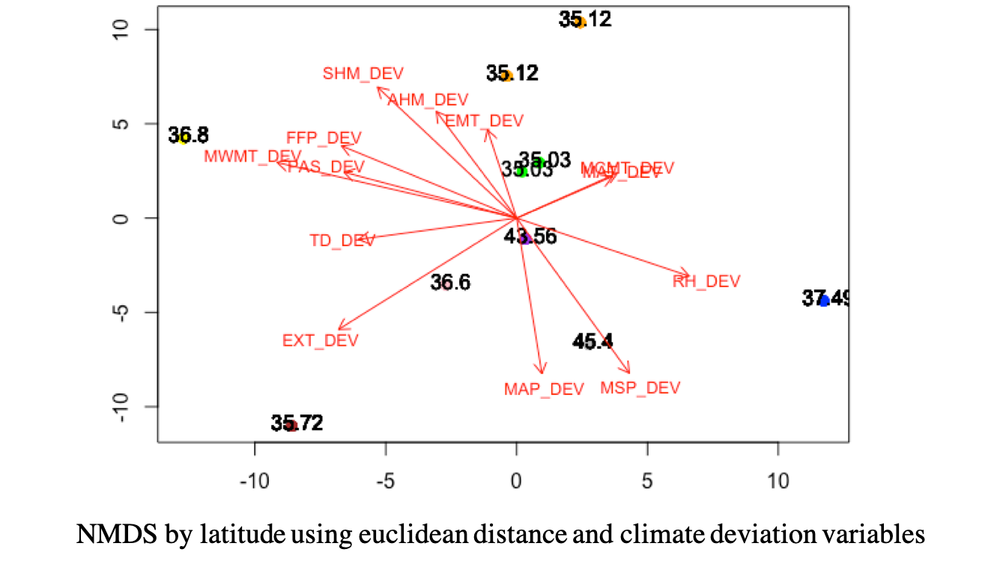

# Does climate deviation can predict if restoration of terrestrial ecosystems will be successful? 

In this study I want to analyze if there is a relationship between **climate deviation** and the success of **restoration** in terrestrial ecosystems.  If climatic conditions have deviated from the climate normal values during which the restoration goals were established, the conditions for successful restoration might not exist in the same way as before. To do so I will do a meta-analysis looking at terrestrial restoration studies in North America initially and then globally. I will first estimate climate deviation and important climatic variables to consider. Then I will analyze the relationship between climate deviation and restoration success and the possible effects of variables like latitude, ecosystem type and restoration metric. Consideration of recent changes in climatic conditions when developing management plans and establishing restoration targets could help identify restoration priorities (Figure1). Sites where the climatic conditions have deviated from normal values could either adjust their targets or active restoration efforts could be better directed to less altered ecosystems. 

   

 Figure 1. Restorative continuum. "Activities undertaken by society to repair damage to the broader environment, complement ecological restoration and provide improved conditions for broad scale recovery". From the [Society for Ecological Restoration](https://www.ser.org/general/custom.asp?page=SERNews3112)

## 1. Intro

Ecological restoration intends to re-establish, improve or create ecosystem functions or characteristics previous to a disturbance. The recovery of an ecosystem following restoration then is measured against extant reference ecosystems or pre-disturbance conditions in the same ecosystem [1]. Climate is intrinsically implicated in restoration because it influences current ecosystem processes and attributes, affecting the ecological path an ecosystem follows following restoration activities[2]; and because climate varies in time it can affect restoration goals and/or metrics that are based in past climate conditions. Moreover, current climatic conditions in certain regions are rapidly changing, and extreme climatic events have been more frequent across the globe [3,4]. Hence, if restoration and ecosystem management plans do not consider changes in climate, they may fall out of context and become impractical when faced with current and future changes brought by climate extremes and other associated disturbances [2,5].  

A meta-analysis study on the recovery of restored ecosystems following disturbances found that although ecosystems progress towards restoration, usually a complete recovery is never reached [6]. But importantly, the authors also found that the degree and rate of recovery was variable depending on factors like ecosystem type and the recovery metrics used to measure restoration success. Monitoring the outcomes of restoration actions against the restoration targets is necessary and although restoration projects have been increasingly performing an evaluation [7], this is usually done on an individual-project basis, hence knowledge on patterns of recovery across different ecosystems globally is still reduced [6,8]. 

To address this, there have been proposals to for assessing the previous climatic conditions in the site that is to be restored. Some of these have involved the use of climate normals as reasonable time period to compare [2,4,9,10]. If climatic variables in a disturbed ecosystem have deviated considerably compared to its climate normal values, the conditions for restoration might not exist in the same way as before. Thus, by assessing the recovery of past restoration sites based on the restoration metric of the meta-analysis by Jones and collaborators [6], and incorporating the climate values to assess climate deviation from normals,  I intend to test if it could be a tool for future management plans and establishing restoration goals. 

   

 Figure 2. Trajectory of an ecosystem following restoration affected by climate variation. Modified from reference [6]

### Research objectives

- Establish restoration success (response ratio of recovery completeness) for studies from 2013-2020 in North America - (*identified from data exploration*)

- Determine if there are climatic variables that affect the recovery trajectory of a restored ecosystem more than others

- Identify if there is relationship between climate deviation and restoration success and which factors participate in the direction and strenght of the relationship (e.g. ecosystem type, latitude, restoration period, recovery metric) 

### Expected results

Increasing climate deviation from climate normal values in a site will have a negative relationship with restoration succes. This will be dependent on the type of ecosystem and latitude where restoration occurred, the type of metric used to evaluate restoration success, and the climatic variable considered. If there isa  relationship is, then this could serve in restoration ecology for creating restoration models and could eventually be used in restoration practice. The identification of sites where relevant climatic variables (according to the ecosystem and latitude) have deviated considerably,  would help establish restoration priorities to save time and money. Active restoration could be targeted towards places more prone to recover. 

## 2. Methods 

In the early stages of this project I am exploring three different climate deviation estimations:

1. **AVERAGE**: Obtain the average value across restoration period and subtract from this the corresponding climate normal value for each climate variable
2. **GREATEST DIFFERENCE**: Choose the value that deviated the most from the climate normal value across the restoration period and subtract from this the corresponding climate normal value for each climate variable (*In progress: to be calculated and added to this site*)
3. **LAST RESTORATION YEAR**: Choose the values for the last year during which restoration took place and subtract from this the corresponding climate normal value for each climate variable 

   

Figure 3. Intended project pipeline

##

Obtaining climate values: Since the period when each restoration varied in duration and start year,  climate normals and historical time series for annual climate variables were designated on a study by study basis. That is, according to the year when the restoration started, the closest climate normal period was chosen for each study. For the historical time series, a period encompassing the first year to the last year of restoration was selected for each study. 

## 3. Data 

The central goal of this study is to measure the relationship between deviation of climatic variables (*predictor variable*) and recovery completeness (*response variable*) by doing a meta-analysis. For this end there will be 2 datasets that will be combined in the final analysis: 

1. The original [datatable](data/Clim_dev_test.csv) containing all restoration metrics and study information
2. The [datatable](data/DEV3.csv) (one per climate deviation calculation method) containing all climate deviation values

- Experimental units: each ecosystem aspect that was evaluated in restoration is an experimental unit, but this is nested within the study where it comes from, i.e. observations are not independent. 

During this stage I am doing data exploration of the second dataset by:

1. Calculating the deviation for each climate variable with the 3 different methods and assessing the uselfulness of each
2. Establishing the climate variables that will be most useful

This is how the second [dataset](data/DEV3.csv) looks like where the climate variables (predictor variables) are continuous: 

*Table1. Dataset of studies and climate deviation values*

   

Where each observation is a row and columns are the climate deviation values (the complete datafile contains more climate variables that the ones shown here). 

*Table 2. Variables used in dataset of Table 1*

   

### Exploration of observations grouping by study and using latitude as identifiers ###

Data were first scaled because of the unit differences across climate variables. 
Vectors show deviation values for climate variables, testing if latitude has if climate variables explain the variation across latitudes. 

   

Figure 3 [NMDS](bin/EXPLORING_DEVIATION_DATA.R) using a euclidean distance matrix

##

During data exploration I detected the project will need to incorporate more studies within North America at this stage. After filtering for the required parameters, the sample size was greatly reduced (**n=10**). Although restoration observations are considerable for a thorough comparison, the climate values associated to each observation are dependent on the location of the study, which remains unchanged across all observations coming from the same study. So, **observations are nested within study**. Since this is a meta-analysis in the search for patterns, I need as many datapoints as possible to be able to compare across latitudes and ecosystem types within the North America region. Following steps then are: 

1. Incorporate terrestrial restoration studies in North America from 2013-2020 to the original database
2. Calculate response ratios of recovery completeness for new studies
3. Data exploration with increased database
4. Statistical analysis: establishing associations between climate deviation dataset and recovery completeness dataset 

## 4. Results and Discussion (*in progress*)

This meta-analysis eventually will move from North America to incorporate restoration studies from around the globe. I am still unsure on which climate database to use to obtain my global values. 

I think the most important analysis for climate deviation will be the one looking at the extreme climatic values or greatest difference. But I need to adjust for the duration of the study if I use this metric to estimate climate deviation. 

Following data exploration when more datapoints have been added, I will explore the relationship between the first and the second dataset by using classification and regression tree analysis. 

## 5. Conclusions, About, References (*in progress*)

### References ###
[1] Hobbs, R. J., & Norton, D. A. (1996). Towards a conceptual framework for restoration ecology. Restoration ecology, 4(2), 93-110 

[2] Millar, C. I., & Woolfenden, W. B. (1999). The role of climate change in interpreting historical variability. Ecological Applications, 9(4), 1207-1216.

[3] IPCC: Climate Change 2014: Synthesis Report, in: Contribution of Working Groups I, II and III to the Fifth Assessment Report of the Intergovernmental Panel on Climate Change, edited by: Core Writing Team, Pachauri, R. K., and Meyer, L. A., IPCC, Geneva, Switzerland, 151 pp., 2014.

[4] Robinson, A., Lehmann, J., Barriopedro, D., Rahmstorf, S., & Coumou, D. (2021). Increasing heat and rainfall extremes now far outside the historical climate. npj Climate and Atmospheric Science, 4(1), 1-4.

[5] Harris, J. A., Hobbs, R. J., Higgs, E., & Aronson, J. (2006). Ecological restoration and global climate change. Restoration Ecology, 14(2), 170-176.

**[6] Jones, H. P., Jones, P. C., Barbier, E. B., Blackburn, R. C., Rey Benayas, J. M., Holl, K. D., ... & Mateos, D. M. (2018). Restoration and repair of Earth's damaged ecosystems. Proceedings of the Royal Society B: Biological Sciences, 285(1873), 20172577.**

[7] Lake, P. S. (2001). On the maturing of restoration: linking ecological research and restoration. Ecological Management & Restoration, 2(2), 110-115.

[8] Meli, P., Holl, K. D., Rey Benayas, J. M., Jones, H. P., Jones, P. C., Montoya, D., & Moreno Mateos, D. (2017). A global review of past land use, climate, and active vs. passive restoration effects on forest recovery. Plos one, 12(2), e0171368.

[9] Soule, P. T. (2005). A comparison of 30-yr climatic temperature normals for the southeastern United States. southeastern geographer, 45(1), 16-24.

[10] Copeland, S. M., Munson, S. M., Bradford, J. B., & Butterfield, B. J. (2019). Influence of climate, post‐treatment weather extremes, and soil factors on vegetation recovery after restoration treatments in the southwestern US. Applied Vegetation Science, 22(1), 85-95.

